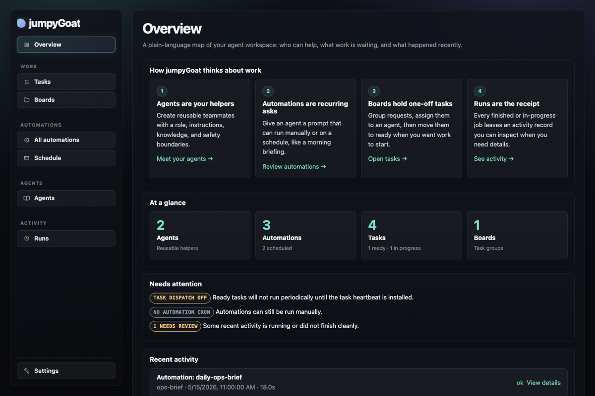
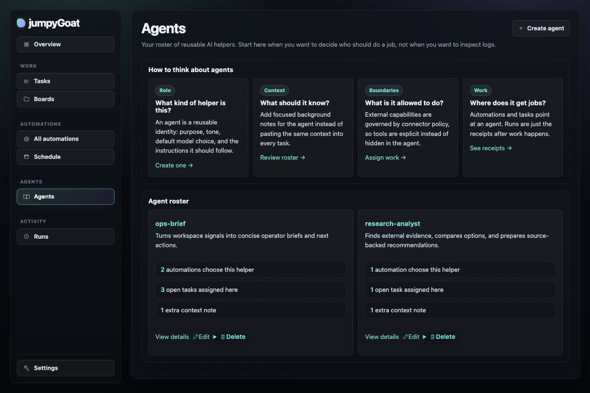
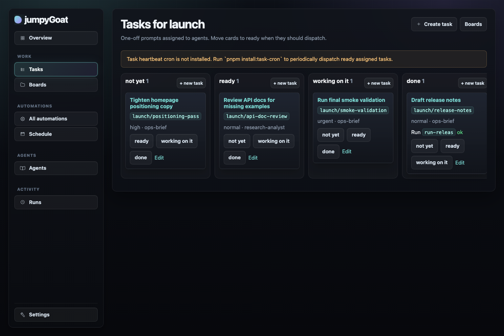
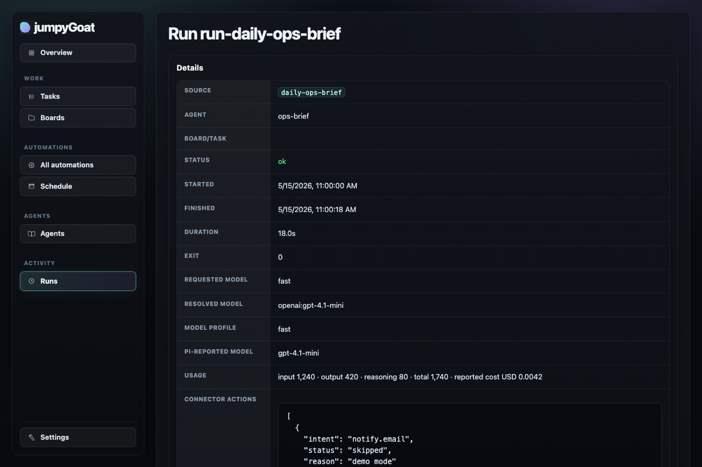

# jumpyGoatHq

**A tiny, file-native control plane for Pi-powered agents.**

Define agents in markdown, give them scheduled automations or one-off tasks, run them through [Pi](https://www.npmjs.com/package/@earendil-works/pi-coding-agent), and keep an auditable local history of what happened.

```txt
agents as markdown → schedules/tasks/operator commands → Pi runs → SQLite run history
```

jumpyGoatHq is for people who want recurring AI work to feel inspectable and self-hostable, without adopting a workflow builder, hosted agent platform, or custom LLM loop.

> Pre-release: agents are the user-facing runtime primitive. Breaking changes are still allowed when they make the primitives clearer.

## Why use it?

- **Make reusable agents, not one-off prompts.** Each agent is a small bundle: `AGENT.md` plus optional `context/*.md`.
- **Run work from files.** Automations, boards, and tasks are markdown files you can inspect, diff, back up, and edit directly.
- **Use Pi for the hard part.** Pi remains the harness and tool loop; jumpyGoatHq adds scheduling, task dispatch, connector gates, and observability around it.
- **Know what happened.** Every automation or task produces a SQLite run record with status, output, trace text, model audit fields, and usage when Pi reports it.
- **Stay local-first.** The default web UI binds to `127.0.0.1`, mutable workspace data is gitignored, and deployment state can live under `JUMPYGOATHQ_HOME`.

## Screenshots



| Reusable agents | File-backed task board |
|---|---|
|  |  |



## Core primitives

| Primitive | What it means | Stored as |
|---|---|---|
| **Agent** | Reusable Pi runtime persona/instructions/context/policy bundle | `workspace/agents/<agent>/AGENT.md` |
| **Automation** | Manual or scheduled prompt for one agent | `workspace/automations/<automation>.md` |
| **Board/task** | Markdown kanban and assignable one-off work | `workspace/boards/<board>/...` |
| **Run** | Auditable execution receipt | `workspace/data/jumpygoat-hq.sqlite` |
| **Connector/tool** | Gated external capability such as web search or email | connector config + env secrets |

## Quick start

```bash
pnpm install
pnpm build
pnpm run doctor
```

Install and authenticate Pi as the same Unix user that will run jumpyGoatHq or cron:

```bash
npm install -g @earendil-works/pi-coding-agent
pi /login
pi --mode json --no-session "hello"
```

Optional local environment overrides and secrets go in `.env.local`:

```bash
cp .env.example .env.local
# edit .env.local if needed
```

This repo ships as a template with no active agents, automations, tasks, or SQLite data. By default mutable instance state lives under local `workspace/` and is gitignored. Set `JUMPYGOATHQ_HOME=/path/to/jumpygoat-hq-home` to place that state somewhere else for deployment. For a VPS/systemd install, see [`docs/DEPLOY.md`](docs/DEPLOY.md); for existing server updates/rebuilds, see [`docs/UPDATE.md`](docs/UPDATE.md).

## Create your first agent and automation

Create `workspace/agents/daily-review/AGENT.md`:

```md
---
name: daily-review
description: Reviews current work and produces a concise daily brief.
model: fast
allowedIntents: []
---

You are the daily review agent. Be concise. Identify blockers, due items, and recommended next actions.
```

Create `workspace/automations/daily-review.md`:

```md
---
agent: daily-review
schedule: "manual"
---

Review the workspace notes and open tasks. Tell me what needs attention today.
```

Run it:

```bash
pnpm runner daily-review
```

Open the web UI:

```bash
pnpm web
# http://127.0.0.1:3000
```

The UI is intentionally raw server-rendered HTML. It shows agents, automations, boards/tasks, a kanban board, scheduled run agenda, cron evidence, runs, run details, settings, and a simple “Run now” button.

## Scheduled automations

Automation schedules are either `manual` or 5-field cron expressions in automation frontmatter:

```yaml
schedule: "0 9 * * *"
```

Install, inspect, or remove local cron entries:

```bash
pnpm install:cron <automation-name>
pnpm list:cron
pnpm uninstall:cron <automation-name>
```

Cron logs go to `workspace/data/cron-<automation>.log` or `$JUMPYGOATHQ_HOME/data/cron-<automation>.log`.

## Assigned task dispatch

Create boards/tasks in the web UI or under `workspace/boards/`. Tasks with `status: ready` and a valid `assignee` can be claimed by the dispatcher:

```bash
pnpm dispatch:tasks           # claims one ready task
pnpm dispatch:tasks --limit=3 # optional small local batch
```

Install an explicit task heartbeat cron when you want periodic dispatch:

```bash
pnpm install:task-cron
pnpm install:task-cron -- --schedule="*/30 * * * *" --limit=2
pnpm list:task-cron
pnpm uninstall:task-cron
```

## Model profiles

Agents and automations can use either direct Pi model selectors or local semantic profile keys such as `fast` or `super-smart`. Configure profiles in `workspace/settings.yml` or through `/settings`:

```yaml
defaultModelProfile: fast
modelProfiles:
  fast: "provider:fast-model"
  super-smart:
    selector: "provider:smart-model"
    label: "Super smart"
```

jumpyGoatHq resolves profile keys before invoking Pi and stores requested/resolved model metadata on each run. Pi still owns provider auth, API keys, custom providers, and concrete model availability. Do not put secrets in `settings.yml`.

## Optional email notifications

Email notifications are opt-in and gated. The runner sends email only when the agent allows `notify.email`, the agent or automation enables the email connector, Pi requests the action, and Resend config is present.

```bash
RESEND_API_KEY=re_...
JUMPYGOATHQ_NOTIFY_EMAIL_TO=you@example.com
JUMPYGOATHQ_NOTIFY_EMAIL_FROM="jumpyGoatHq <agent@yourdomain.com>"
JUMPYGOATHQ_NOTIFY_SUBJECT_PREFIX="[jumpyGoatHq] "
```

For real delivery, verify the `from` domain/address in Resend and make the same env available to cron.

## Local validation

Use these from the repo root while developing:

```bash
pnpm validate:web       # Playwright smoke checks for the raw HTML web UI
pnpm validate:backend   # creates/runs one temporary Pi-backed smoke automation
pnpm validate           # web smoke, then backend smoke
```

Common fixes:

- Port in use: `PLAYWRIGHT_PORT=3124 pnpm validate:web`
- Browser missing: `pnpm exec playwright install chromium`
- Pi auth/provider missing: `pi /login` and `pnpm run doctor`

## More docs

- Product north star: [`docs/vision/strategy/agent.md`](docs/vision/strategy/agent.md)
- Target spec: [`tasks/spec.md`](tasks/spec.md)
- Architecture: [`docs/ARCHITECTURE.md`](docs/ARCHITECTURE.md)
- Web UI package notes: [`packages/web/DOCS.md`](packages/web/DOCS.md)
- End-to-end agent testing: [`docs/testing/end-to-end-agent.md`](docs/testing/end-to-end-agent.md)

## What this is not

- Not a workflow builder or DAG editor.
- Not a broad personal-assistant clone.
- Not a hosted SaaS or multi-user RBAC product.
- Not a custom LLM/tool loop.
- Not a generic repo-wide chat surface.

The goal is the smallest useful open-source agent operations layer: strong primitives, limited features, and clear extension seams.
